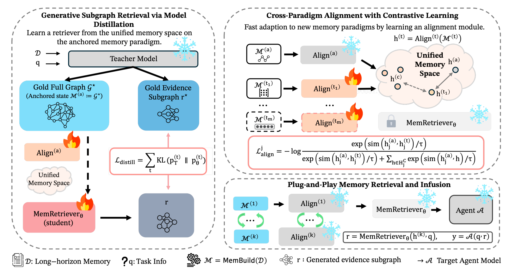

# MemAdapter



Minimal code release for the paper's **MemAdapter** two-stage pipeline:
1) Teacher supervision generation (structured graphs + token-level logprobs)
2) Stage-1 student distillation (CE + token-level KL; gradient accumulation)
3) Stage-2 cross-paradigm alignment (InfoNCE) and enhanced evaluation

## Quick Start

### Stage 1 (Teacher + Distillation)
```bash
cd stage1
bash scripts/training/run_curriculum.sh
```

One-shot Stage-1 training (if teacher outputs are already prepared):
```bash
cd stage1
bash scripts/training/run_stage1.sh
```

### Stage 2 (Alignment + Evaluation)
Optional: build Stage-2/Test splits:
```bash
cd stage2
python build_stage2_and_test.py
python merge_datasets.py
```

Train Stage-2 alignment:
```bash
python -m src.train.train_stage2 \
  --memory_outputs_dir <memory_outputs_dir> \
  --evidence_embeddings_path <evidence_embeddings_path> \
  --paradigms amem streaming \
  --model_size 1.5B \
  --stage1_checkpoint <stage1_checkpoint_dir_or_file> \
  --output_dir outputs/stage2_alignment
```

Enhanced evaluation:
```bash
python -m src.eval.test_enhanced_correct \
  --paradigm streaming \
  --model_size 1.5B \
  --stage1_checkpoint <stage1_checkpoint_dir_or_file> \
  --stage2_checkpoint <stage2_alignment_checkpoint_dir_or_file> \
  --device cuda
```

## Citation
If you use this code, please cite the MemAdapter paper.

<!--

这是用于论文/GitHub提交的精简版代码仓库，仅保留“高质量结果版本”对应的核心实现：

1. Teacher 监督信息生成
2. Stage1 蒸馏训练
3. Stage2 对齐训练与增强测试

## 目录

- `config/`：核心参考配置
- `README_IMPLEMENTATION.md`：三阶段实现说明（Teacher / Stage1 / Stage2）
- `docs/CODE_STRUCTURE.md`：关键代码结构清单
- `stage1/`：Teacher 生成 + Stage1 训练 + 核心测试
- `stage2/`：Stage2 对齐 + 核心评测脚本

## 保留的核心代码

- Teacher 生成：`stage1/src/data/teacher_generate_vllm_safe.py`（结构化证据 + 保存 token-level `logprobs` 用于 KL 蒸馏）
- Stage1 训练：`stage1/src/train/train_stage1.py`、`stage1/src/train/curriculum_trainer.py`
- Stage1 模型：`stage1/src/model/student.py`、`stage1/src/model/anchor_align.py`
- Stage2 对齐：`stage2/src/train/train_stage2.py`、`stage2/src/models/alignment.py`、`stage2/src/models/projection.py`
- Stage2 测试：`stage2/src/eval/test_enhanced_correct.py`

## 典型运行流程

### Stage1（Teacher + 蒸馏）

```bash
cd stage1
bash scripts/training/run_curriculum.sh
```

> 说明：Stage1 的 KL 蒸馏需要 teacher 的 token-level `logprobs`，脚本会开启 `--save_teacher_logprobs` 并使用 strict 子图校验 prompt（`*_strict.txt`）。

### Stage2（对齐训练）

```bash
cd stage2
python -m src.train.train_stage2 \
  --memory_outputs_dir <memory_outputs_dir> \
  --evidence_embeddings_path <stage1_evidence_embeddings.npy> \
  --output_dir outputs/stage2_alignment
```

### Stage2（增强测试）

```bash
cd stage2
python -m src.eval.test_enhanced_correct \
  --paradigm streaming \
  --model_size 1.5B \
  --stage1_checkpoint <stage1_checkpoint_dir> \
  --stage2_checkpoint <stage2_alignment_checkpoint_dir>
```

## 已移除内容

- 与核心流程无关的冗余 README / 分析文档
- 大体积结果文件（jsonl / npy / checkpoint / logs）
- 非必要实验脚本与一次性调试脚本

如果你要直接作为 GitHub 主仓库提交，建议仓库名使用 `KDD-Memadapter` 或 `MemAdapter`。
-->
